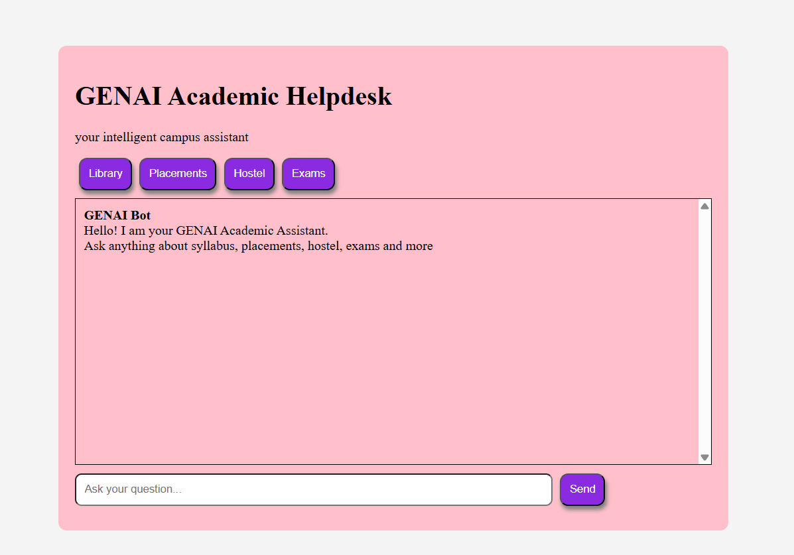

# 🎓 GenAI Academic Helpdesk

## 📖 Project Description

GenAI Academic Helpdesk is an AI-powered chatbot that helps students by answering questions related to college information such as hostel, library, placements, syllabus, and exam circulars. It uses Retrieval-Augmented Generation (RAG) with LangChain and Hugging Face to retrieve answers from PDF documents.

---

## 🚀 Features

- 📄 Reads multiple PDF documents
- 🤖 AI-powered chatbot
- 🏫 Answers questions about:
  - Hostel
  - Library
  - Placements
  - Syllabus
  - Exam Circulars
- 👨‍🎓 Student information lookup
- 🔍 Semantic search using embeddings
- 📚 Retrieval-Augmented Generation (RAG)
- 🌐 Flask web application

---

## 🛠 Technologies Used

- Python
- Flask
- LangChain
- Hugging Face Transformers
- ChromaDB
- Sentence Transformers
- HTML
- CSS
- JavaScript

---

## 📂 Project Structure

```
AIML Project/
│
├── app.py
├── requirements.txt
├── templates/
│   └── index.html
├── uploads/
│   ├── College Information System.pdf
│   ├── hostel.pdf
│   ├── placement.pdf
│   ├── circular.pdf
│   └── syllabus.pdf
└── README.md
```

---

## ⚙ Installation

Clone the repository

```bash
git clone https://github.com/bhavya906/GenAI-Academic-Helpdesk.git
```

Move to the project folder

```bash
cd GenAI-Academic-Helpdesk
```

Install the dependencies

```bash
pip install -r requirements.txt
```

Run the application

```bash
python app.py
```

Open in your browser

```
http://127.0.0.1:5000
```

---

## 📷 Screenshots


---

## 🔮 Future Enhancements

- Voice Assistant
- PDF Upload from UI
- User Login
- Chat History
- Admin Dashboard
- Support for more college documents

---

## 👩‍💻 Author

Bhavya